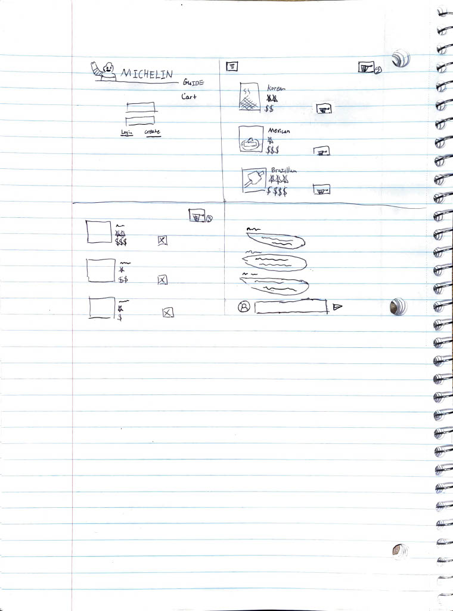

CS260 Notes
[notes.md](https://github.com/gwanghong/startup/blob/main/notes.md)

# Aim bot
  ## Elevator pitch
 Somedays, there will be days when it feels like it's not your day on fps games like Call of Duty, Pubg, etc. Practicing on this Aim bot web page, will make you a pro on fps games. Players can compare their scores and aim to become the top aim bot.
## Design
  

## Key features
* Secure login over HTTPS
* Storing high scores of all players
* Displaying time and current score board while playing the game
* Storing and showing scores of top players by points and accuracy
* Ability to communicate with other users through Review page

## Technologies
* HTML -        Using four html files. 1st page for login, 2nd page for playing the game, 3rd page for score leaderboard, and last page for review/comment section.
* CSS -         Haven't learned yet
* JavaScript -  Haven't learned yet
* Service -     Haven't learned yet
* DB/Login -    Haven't learned yet
* WebSocket -   Haven't learned yet
* React -       Haven't learned yet

## HTML deliverable
* HTML pages - Four html pages that has the ability to Login, Play, track scores of top players and communicate with others through review/comment page.
* Links - From Login page to Play page
* Text - Short textual introduction of this application at Review page.
* Images - Image for reveiw page
* DB/Login - Input box and submit box for Login. Score, accuracy and date data is stored and if the player got in top 5, his/her data is pulled from database and will become visible on the score board.
* WebSocket - Realtime comments

## CSS deliverable

## JavaScript deliverable

## Service deliverable

## DB/Login deliverable

## WebSocket deliverable

## React deliverable
