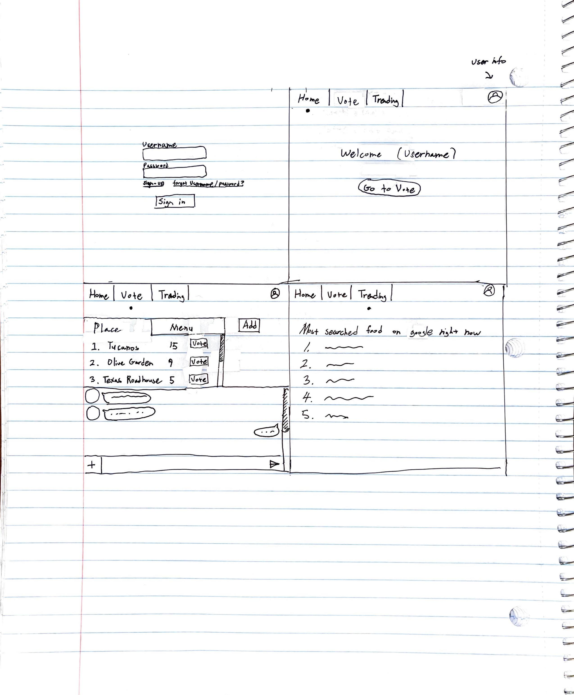

# startup
github assignment
modify 1
\n modification in Github
Change from my development environment and from GitHub
  
  ## What I learned from this assignment
  It was interesting that I can modify github files through VS code (development environment). I'm excited to learn more about this.

  # Elevator pitch
  Somedays, it is difficult for me to pick what to eat for lunch/dinner. There are so many categories to choose. It could be 
  chinese, korean, japanese, western food, 
  spicy or non spicy,
  bread, rice, noodles,
  hot or cold, etc.
  We can choose by voting with friends,
  or by checking trending food ranks from other delivery apps,
  or by relying on random pick from the app. 

  

# Simon
It was a great opportunity to work on Simon project since it covered the things we learned in the previous assignments. I now have a better understanding on structures, links, and tables with hands on experience.

# Simon CSS
In the past assignment, we programmed Simon buttons on HTML, and now we took those programs out of HTML and embedded to CSS code. The program itself is more simple and easier to understand. Also it has better visualization compared to just using HTML.