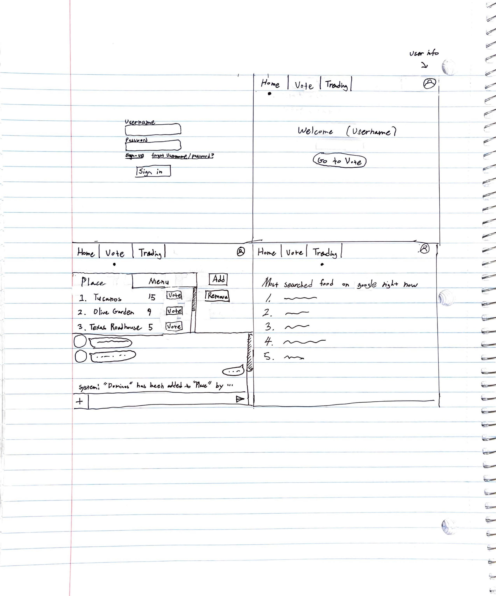

CS260 Spring Notes
[notes.md](https://github.com/gwanghong/startup/blob/56910789136784b6247a91ac028732dbc887475c/notes.md)

# Menu Voter
  ## Elevator pitch
  Somedays, it is difficult to pick what to eat for lunch/dinner. There are so many categories to choose. It could be 
  chinese, korean, japanese, western food, 
  spicy or non spicy,
  bread, rice, noodles,
  hot or cold, etc.
  We can choose by voting with friends,
  or by checking trending food ranks from other delivery apps,
  or by relying on random pick from the app. 

  

